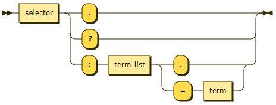
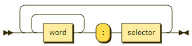
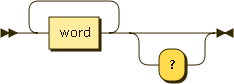
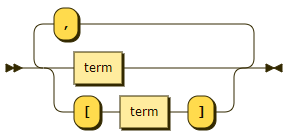
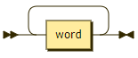
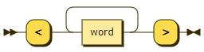

# Ainsley

## Grammar

```ebnf
interface ::= property | method outputs?

property ::= selector "?"?

method ::=
  selector "."
  | selector "?"
  | selector ":" term-list ("." | "=" term)

outputs ::=
  word+ ":" selector (word+ ":" selector)*

selector ::= word+

term ::= sync-data | async-data | lambda

term-list ::= (term | "[" term "]") ("," (term | "[" term "]"))*

sync-data ::= word+

async-data ::= "<" word+ ">"

lambda ::= "{" (selector "!" | term-list | term-list? "=" term) "}"
```

## Overview

### Interface

Each line is a separate interface, each interface either a property or a method.


### Property


### Method



### Outputs



### Selector



### Terms




### Lambda


### Sync data



### Async data


