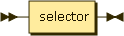
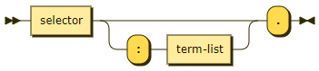
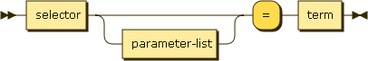
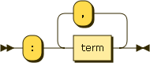
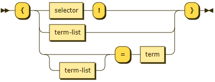
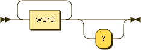
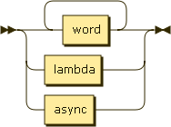

# Ainsley

## Grammar

```ebnf
interface ::= (property | method)

property ::= selector "?"?

method ::= selector "?"? (":" term-list ("." | "=" term))?

lambda ::= "{" (selector "?"? | (":" term-list) | (":" term-list)? "=" term) "}"

selector ::= word+

term ::= (sync-data | async-data | lambda)

term-list ::= term ("," term)*

sync-data ::= word+

async-data ::= "<" word+ ">"
```

## Overview

### Interface

Each line is a separate interface, each interface either a property, procedure, or function.


### Property



### Procedure



### Function



### Parameter list



### Lambda



### Async


### Selector



### Term


