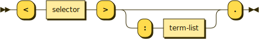

# Async procedures

```bnf
async-procedure ::= '<' selector '>' (':' term-list)? '.'
```



Asynchronous procedures are functions that promise to return void. Their selectors are surrounded by angle brackets and end with period outside the brackets. Though they will resolve void, they can still be rejected.

```typescript
// <Stingy cloudy>.
public stingyCloudy(): Promise<void>

// Stingy cloudy.
public stingyCloudySync(): void

// <Pretend lace>: hurt.
public pretendLace(hurt: number): Promise<void>

// Pretend lace sync: hurt.
public pretendLaceSync(hurt: number): void
```