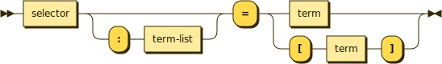

# Functions

```bnf
function ::= selector ( ':' term-list )? '=' ( term | '[' term ']' )
```



Functions are methods that return a value that's not boolean. The description of the return value follows an equals sign.

```typescript
// Offer harm = description
public offerHarm(): string

// Deep rest: queen = details of update
public deepRest(queen: string): RecordUpdate
```

**Optional** return values are written similarly to optional parameters.

```typescript
// Get resource owner = [ID if exists]
public getResourceOwner(): number | void
```