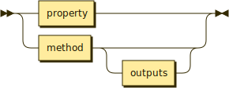

# Interfaces

Interfaces are either ways that control of execution can flow into a unit or how it can flow out to other units.

## Inputs



A unit's inputs either describe:

1. a [property](properties.md), which is a piece of state data in the unit which is publically accessible, or
2. a [method](method.md), which is a goal this unit is capable of achieving on behalf of others.

Both properties and methods are [selectors](selectors.md) but they contain other information, such as a description of their types or return values, which combined with other information about how they're accessed.

## Outputs

A unit's methods may send control of execution out to another unit, which are outputs. Only the first level of the callstack is described.


Each line names the other unit being referenced with the selector being called.

```typescript
// <Delete user>: ID.
//   - Database: find user by ID.
//   - Fs: remove file.
public deleteUser(id: number): Promise<void> {
  this.database.findUserById(id)
    .then(user => user.delete())
    .then(user => fs.removeFile(user.logFile))
    .then(err => {
      if (err)
        throw err;
      this.log(`User removed.`)
    })
}
```