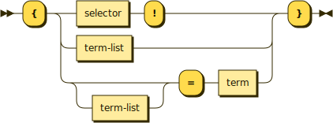

# Lambdas

```bnf
lambda ::= '{' (selector '!' | term-list | term-list? '=' term) '}'
```



Lambdas are surrounded by curly braces. They could be said to have the following three parts, the same as a method, except each of them is optional.

```
{stick: mellow, ladybug = act}
 ^^^^^    \      /        ^^^
Selector  Parameters      Return value
```

Selectors are generally not useful for lambdas and are mostly omitted. That gives us the following useful patterns.

|    Name     | Select? | Param? | Return? |
| :---------: | :-----: | :----: | :-----: |
|   *done*    |   Yes   |   No   |   No    |
|   *then*    |   No    |  Yes   |   No    |
|  *getter*   |   No    |   No   |   Yes   |
| *transform* |   No    |  Yes   |   Yes   |

## Done lambdas

**Done** lambdas (or maybe unary lambdas) have no parameters and no return value. They're used for `done` callbacks that indicate when something finished but otherwise delivers no other data. Effectively the selector is used because there's nothing else to describe it.

```typescript
// Label slip: {}.
// Label slip: {done!}.
// Label slip: done!.
public labelSlip(done: () => void): void
```

```typescript
// Remove lock file: {}.
public removeLockFile(done: () => void): void
// Selector: Remove lock file
// Parameters: {}
```

## Then lambdas

**Then** lambdas accept parameters but return nothing, used for delivering values asynchronously. The selector and the return value are omitted.

```typescript
// Read file: filename, {[error], file contents}.
public readFile(filename: string, done: (err?, data) => void): void
```

## Getters

**Getters** have no parameters but do have a return value. These must have a closure over some kind of state and use it for their return, else they would be constant functions.

```typescript
// Cast thankful = {= timestamp}
// Cast thankful = {() = timestamp}
public castThankful(): { () => number }
```

## Transforms

**Transforms** take parameters and return values.

```typescript
// Wrap function: {before = after} = {before list = after list}
public mapFunction(fn: Function): Function
```