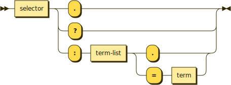

# Methods

```bnf
method ::= selector '.' | selector '?' | selector ':' term-list ('.' | '=' term)
```



Methods describe behavior. They may have parameters and may have return values. Methods are sub-divided by what kind of return value they give:

| Return type | Symbol |            Name            |
| :---------: | :----: | :------------------------: |
|    Void     |  `.`   | [Procedure](procedures.md) |
|   Boolean   |  `?`   | [Predicate](predicates.md) |
|    Void     |  `=`   |  [Function](functions.md)  |

