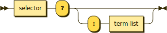

# Predicates



Methods that return a boolean. There is no distinction between predicates and boolean properties.

```typescript
// Lacking?
public lacking(): boolean
```

The question mark is part of the selector, so unlike the period for procedures, the question mark for predicates goes before the parameter list.

```typescript
// Turn light?: lumber
public turnLight(lumber: number): boolean
```

The predicate can have boolean parameters, where the question mark is used for it as well as the selector.

```typescript
// Texture report?: pan, puzzled?
public textureReport(pan: number, puzzled: boolean): boolean

// Sense room?: trite?, join
public senseRoom(trite: boolean, join: string)
```