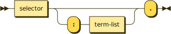

# Procedures

```bnf
procedure ::= selector (':' term-list)? '.'
```



Procedures are methods returning void. They end with a period, which distinguishes them from properties.

```typescript
// Tank race.
public tankRace(): void
```

**Boolean** parameters are followed by question marks the same as boolean properties.

```typescript
// Explain truck: neat?.
public explainTruck(neat: boolean): void
```

**Multiple** parameters are separated by commas.

```typescript
// Waste maddening: milky, crown, light.
public wasteMaddening(milky: number, crown: string, light: number): void
```

**Optional** parameters are surrounded by square brackets. Optional boolean parameters include the question park inside the brackets.

```typescript
// Bury crime: trade, [cup].
public buryCrime(trade: Record, cup?: string): void

// Willing bag: [look?].
public willingBag(look?: boolean): void

// Appreciate: handle?, eager.
public appreciate(handle: boolean, eager: number): void
```