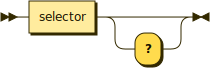

# Properties

```bnf
property ::= selector '?'?
```



Properties describe data. Boolean properties are followed by a question mark.

```typescript
// Unite
public unite: string

// Afternoon visit
public afternoonVisit: number

// Visible?
public visible: boolean
```
