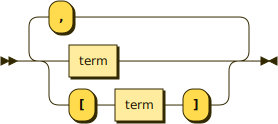

# Terms

A term is a set of one or more pieces of data coming in or going out of an interface. When coming in, the terms are method parameters; when going out, the terms are return values.

There are different styles for:

1. synchronous terms, which are the same as [properties](properties.md),
2. async terms, and
3. lambda terms.

Multiple terms can be provided, separated by commas. Optional terms are surrounded by square brackets.

