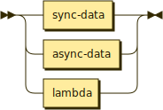

# Terms

```bnf
term ::= sync-data | async-data | lambda
```



```bnf
term-list ::= (term | '[' term ']') (',' (term | '[' term ']'))*
```


Terms are descriptions of data (or code being used as data).