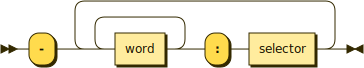

A unit's methods may send control of execution out to another unit, which are outputs. Only the first level of the callstack is described.



Each line names the other unit being referenced with the selector being called.

```typescript
// <Delete user>: ID.
//   - Database: find user by ID.
//   - Fs: remove file.
public deleteUser(id: number): Promise<void> {
  this.database.findUserById(id)
    .then(user => user.delete())
    .then(user => fs.removeFile(user.logFile))
    .then(err => {
      if (err)
        throw err;
      this.log(`User removed.`)
    })
}
```