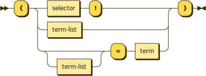

# Lambdas



Lambdas are similar to methods except they are treated the same as data, meaning they can be terms. Lambdas are surrounded by curly braces, with one exception. They have the same three parts a method except each of them is optional.

```
{stick: mellow, ladybug = act}
 ^^^^^    \      /        ^^^
Selector  Parameters      Return value
```

If only a single term is within the curly braces, it represents a parameter.

Selectors are omitted except when there are no parameters nor return value. Only the following combinations represent useful patterns.

|   Name    | Selector? | Parameters? | Return? |
| :-------: | :-------: | :---------: | :-----: |
|   Block   |    Yes    |     No      |   No    |
|   Then    |    No     |     Yes     |   No    |
|  Getter   |    No     |     No      |   Yes   |
| Transform |    No     |     Yes     |   Yes   |

## Blocks

Block lambdas have no parameters and no return value.

Their purpose is to run a fixed set of statements without outside control or observation. This can be used for done callbacks where the statements mutate data in the original caller via closure and don't need parameters or return values.

Since there's nothing else to describe it, the selector is used with a postfix exclamation point.

```typescript
// Remove lock file: done!.
public removeLockFile(done: () => void): void

// Register alarm handler: on alarm! = handler ID
public registerAlarmHandler(onAlarm: () => void): number
```

## Thens

Then lambdas accept parameters but return nothing, used for delivering values asynchronously. The selector and the return value are omitted.

```typescript
// Read file: filename, {[error], file contents}.
public readFile(filename: string, done: (err?, data) => void): void
```

## Getters

Getters have no parameters but do have a return value. These must have a closure over some kind of state and use it for their return else they would be constant functions.

```typescript
// Cast thankful = {= timestamp}
public castThankful(): { () => number }
```

## Transforms

Transforms take both parameters and return values.

```typescript
// Lift into list: {before = after} = {before list = after list}
public liftIntoList(fn: Function): Function
```