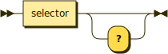

# Properties



Properties describe the state data held inside the unit that is publically accessible.

```typescript
// Unite
public unite: string

// Afternoon visit
public afternoonVisit: number

// Visible?
public visible: boolean
```

Properties are written similar to synchronous [terms](terms.md), except that whereas terms are the incoming or outgoing components of an interface, properties *are* the interface.

In the rare case that properties are asynchronous or lambdas, they would be described the same way but with the surrounding angle brackets or curly braces.

```typescript
// <MAC address>
public macAddress: Promise<string>

// <Done updating>
public doneUpdating: Promise<void>

// <Is connected?>
public isConnected: Promise<boolean>

// {present age = minimum age}
public legalAge: { (age: number): number }
```

