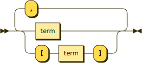

# Terms

A term is a pieces of data coming in or going out of an interface. When coming in, the terms are method parameters; when going out, the terms are return values.

There are different styles for:

1. synchronous terms, which is data available right now (and are just written the same as [properties](properties.md)),
2. [async terms](async-data.md), which is a wrapper around data that will eventually be available, and
3. [lambda](lambdas.md) terms, which is code used as data.

Multiple terms can be provided, separated by commas. Optional terms are surrounded by square brackets.

